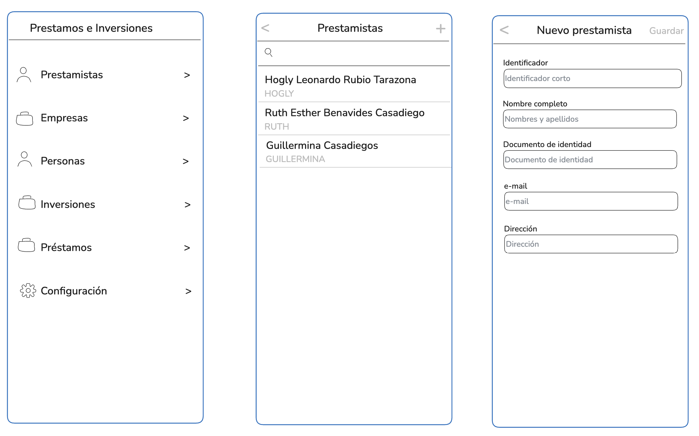

# Prestamos e Inversiones
Sistema para la gestión de Préstamos por Libranzas e Inversiones de capital

## 1. Actores del sistema

### Prestamista 
Persona que tramita el préstamo y gestiona la libranza y cobros.
Es a quien los inversionistas le encargan el dinero para trabajarlo y responden por los pagos.
### Prestatario
Persona asociada a una Empresa, quien se endeuda en el préstamo.
### Empresa
Entidad donde trabaja el cliente, las Empresas hacen el descuento de las cuotas del salario de sus empleados y los consiga.
### Inversionista
Personas que invierten dinero en el negocio y ganan una rentabilidad periódica.

## 2. CASOS DE USO

### Prestamistas
- Listar: 
  - API: ``GET /api/prestamistas``
  - UI: Listado 
- Crear: 
  - API: ``POST /api/prestamistas``
  - UI: Formulario 
- Actualizar: 
  - API: ``PUT /api/prestamistas``
  - UI: Formulario 
### Empresas
- Listar: 
  - API: ``GET /api/empresas``
  - UI: Listado 
- Crear: 
  - API: ``POST /api/empresas``
  - UI: Formulario
- Actualizar: 
  - API: ``PUT /api/empresas``
  - UI: Formulario
- Buscar: 
  - API: ``GET /api/empresas?search=``
  - UI: Caja de texto para buscar en el listado
### Personas
- Crear: 
  - API: ``POST /api/personas``
  - UI: Formulario  
- Actualizar: 
  - API: ``PUT /api/personas``
  - UI: Formulario  
- Listar: 
  - API: ``GET /api/personas``
  - UI: Listado
- Buscar: 
  - API: ``GET /api/personas?search=``
  - UI: Caja de texto para buscar en el listado
### Inversiones
- Crear: ``POST /api/inversiones`` 
- Actualizar: ``PUT /api/inversiones``
- Listar: ``GET /api/inversiones``
- Buscar: ``GET /api/inversiones?search=``
- Registrar pagos: ``POST /api/inversiones/{inversionId}/pagos``
- Listar pagos: ``GET /api/inversiones/{inversionId}/pagos``
- Resumen de inversiones por periodo: ``GET /api/reportes/inversiones?desde=&hasta=`` 

### Préstamos
- Crear: ``POST /api/prestamos`` 
- Listar: ``GET /api/prestamos`` 
- Buscar: ``POST /api/prestamos?search=`` 
- Ver recalculo por pago total anticipado: ``GET /api/prestamos/{prestamoId}?accion=PAGO_ANTICIPADO&fecha=`` 
- Recalculo por pago total anticipado: ``POST /api/prestamos/{prestamoId}?accion=PAGO_ANTICIPADO&fecha=`` 
- Ver Recalculo por cambio en las condiciones: ``GET /api/prestamos/{prestamoId}?accion=CAMBIO_CONDICIONES`` 
- Recalculo por cambio en las condiciones: ``POST /api/prestamos/{prestamoId}?accion=CAMBIO_CONDICIONES`` 
- Registrar pagos: ``POST /api/prestamos/{prestamoId}/pagos``
- Ver pagos: ``GET /api/prestamos/{prestamoId}/pagos`` 
- Generar Listado para cobros: ``GET /api/prestamos?empresa={empresaId}``
- Resumen de utilidades por periodo: ``GET /api/reportes/utilidades?desde=&hasta=`` 

## 3. Modelo de datos
PRESTAMISTA
|field|type|attributes
|---|---|---|
|id|varchar(10)|PK|
|nit|varchar(15)|Not null|
|nombre|varchar(15)|Not null|
|email|varchar(100)|Not null|
|direccion|varchar(100)|Not null|

EMPRESA
|field|type|attributes
|---|---|---|
|id|varchar(36)|PK, UUID auto|
|nit|varchar(15)|Not null|
|nombre|varchar(100)|Not null|
|direccion|varchar(100)||
|contacto|varchar(100)||
|telefono|varchar(100)||
|email|varchar(100)||

PERSONA
|field|type|attributes
|---|---|---|
|id|varchar(36)|PK, UUID auto|
|identificacion|varchar(15)|Not null|
|nombre|varchar(100)|Not null|
|direccion|varchar(100)||
|telefono|varchar(100)||
|email|varchar(100)||
|banco|varchar(50)||
|banco_cuenta|varchar(30)||

INVERSION
|field|type|attributes
|---|---|---|
|id|varchar(36)|PK, UUID auto|
|fecha|timestamp|Not null|
|persona_id|varchar(36)|FK|
|prestamista_id|varchar(36)|FK|
|capital|numeric(12,2)|Not null|
|interes|numeric(12,2)|Not null|
|intereses|numeric(12,2)|Not null|
|periodos|numeric(3)|Not null|
|observaciones|text||
|capital_pagado|numeric(12,2)|Not null|
|intereses_pagado|numeric(12,2)|Not null|
|estado|varchar(10)|Not null (Activo, Terminado, Anulado)|
|foto_url|varchar(1000)|URL de la Letra de Cambio|
|ultimo_pago|timestamp||

INVERSION_PAGOS
|field|type|attributes
|---|---|---|
|id|varchar(36)|PK, UUID auto|
|inversion_id|varchar(36)|FK Not null|
|fecha|timestamp|Not null|
|capital|numeric(12,2)|Not null|
|interes|numeric(12,2)|Not null|
|dias_liquidados|numeric(12,2)|Not null|
|capital_pagado|numeric(12,2)|Not null|
|intereses_pagado|numeric(12,2)|Not null|
|total_pagado|numeric(12,2)|Not null|

PRESTAMO
|field|type|attributes
|---|---|---|
|id|varchar(36)|PK, UUID auto|
|prestamista_id|varchar(36)|FK|
|libranza|varchar(36)|PK|
|fecha|timestamp|Not null|
|persona_id|varchar(36)|FK|
|capital|numeric(12,2)|Not null|
|interes|numeric(12,2)|Not null|
|intereses|numeric(12,2)|Not null|
|cuotas|numeric(3)|Not null|
|cuota|numeric(12,2)|Not null|
|estado|varchar(10)|Not null (Activo, Pagado, Anulado)|
|ultimo_pago|timestamp||
|foto_url|varchar(1000)|URL de la libranza|
|observaciones|text||

PRESTAMO_PAGO
|field|type|attributes
|---|---|---|
|id|varchar(36)|PK|
|fecha|timestamp|Not null|
|prestamo_id|varchar(36)|FK|
|total|numeric(12,2)|Not null|
|capital|numeric(12,2)|Not null|
|intereses|numeric(12,2)|Not null|
|cuota|integer|Not null|
|tipo_pago|varchar(20)|Descuento, Personal|

## 4. UI/UX

Esta es la estructura básica de la UI

